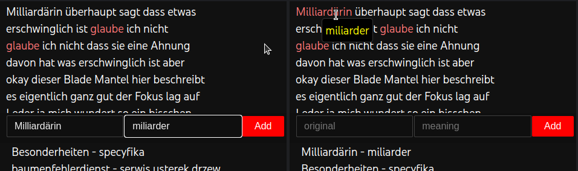
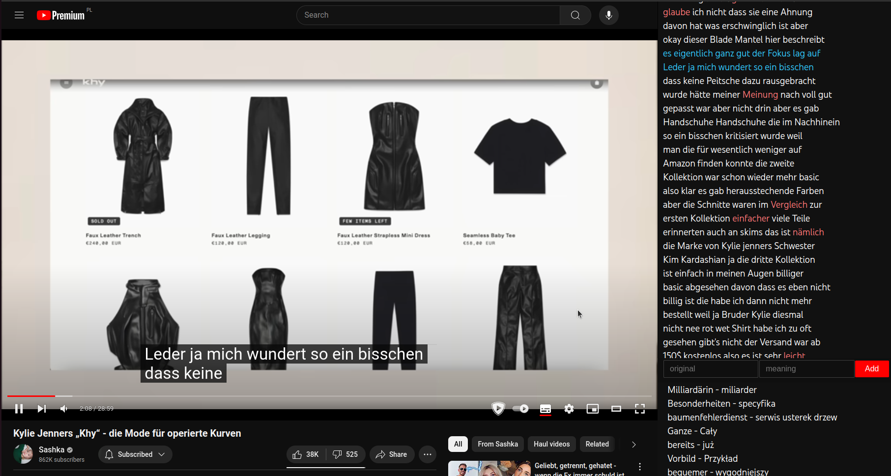
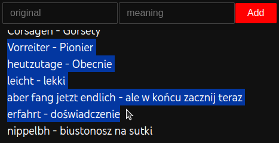
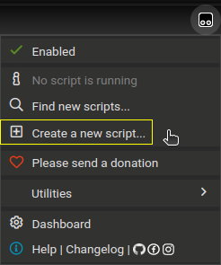
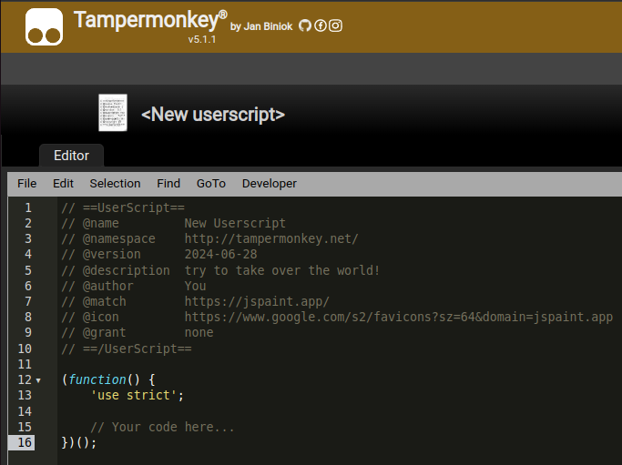
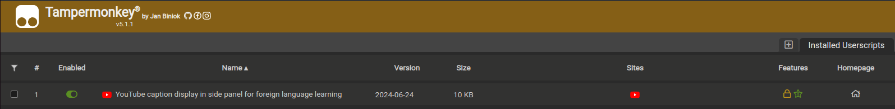

# Side panel displaying YouTube video's subtitles for facilitating easier foreign language learning
[Script](tampermonkey_script.js) usage summary:

## How to use the script - functionalities
After installing the script (see [How to run the script](#how-to-run-the-script)) find a YouTube video you want to watch and refresh page.

#### Lookup unknown vocabulary and save the translations:

#### Follow the captions as the video plays:

#### And finally copy the collected translations to learn the vocabulary:

## How to run the script
### Install tampermonkey extension
[Tampermonkey](https://www.tampermonkey.net/) is a popular userscript manager that allows you to enhance and modify the functionality of web browsers 
like Chrome, Firefox, Safari, and others. 

Userscripts (like [one in this repository](tampermonkey_script.js)) are small pieces of JavaScript that make on-the-fly changes 
to specific web pages as they load, offering a way to personalize or add new features to your browsing experience.

Tampermonkey is available as an extension for example for [Chrome](https://chromewebstore.google.com/detail/tampermonkey/dhdgffkkebhmkfjojejmpbldmpobfkfo).
Install it to proceed.

### Add script to tampermonkey
After installation go to tampermonkey extension and click `Create a new script...`.

Empty template script will be presented (see image bellow). Copy script content from [tampermonkey_script.js](tampermonkey_script.js)
and paste it instead of the template.

Save changes by clicking `ctrl`+`s`.

The script should be available in `Installed Userscripts`:

